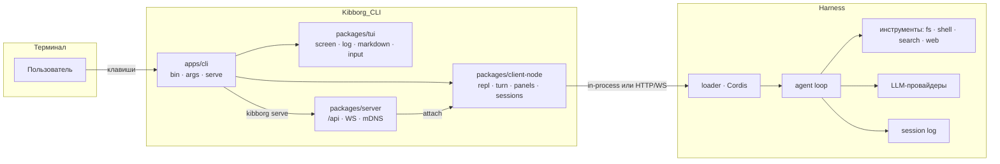

# Kibborg CLI

[](https://github.com/Ydjin1984/Kibborg_CLI/actions/workflows/ci.yml)
[](LICENSE)
[](https://nodejs.org)
[](https://pnpm.io)
[](packages/tui/tests)

**Kibborg CLI** — консольный агент для работы с вашим кодом: полноэкранный TUI, headless-режим для CI и сетевой режим для сервера. Он говорит с тем же агентом, теми же инструментами и теми же сессиями, что и Web-версия harness, но живёт целиком в терминале.

```
  ◆ KIBBORG  v1.0.0   D:/work/project                          kibborg/Kibborg_Flash_v5.7   Agent
  ◇  ready   enter отправить   / команды   shift+tab режим            ▓▓▒▒░░░░░▒▒▓██████

  You
  почему сборка падает на Windows?

    ⚙  grep   "process.platform"                              +0 −0   120ms
      IN  { "pattern": "process.platform", "path": "scripts" }
      OUT scripts/build.ts:41: if (process.platform === 'win32') …

  ## Причина
  | Файл | Строка | Что не так |
  |---|---|---|
  | scripts/build.ts | 41 | путь собирается через «\\» вместо `path.join` |

  ```ts
  const out = join(root, 'dist', 'bundle.js')   // было: `${root}\\dist\\bundle.js`
  ```

  ⋯ ещё 12 строк — Enter, чтобы развернуть

  ──────────────────────────────────────────────────────────────────────────────────────
  │ > █
  ──────────────────────────────────────────────────────────────────────────────────────
  ✻ kibborg/Kibborg_Flash_v5.7 · ctx 12% ▓▓░░░░░░░░ · 7.1s · 23.4k tok · master* · Agent
```

---

## Содержание

- [Возможности](#возможности)
- [Как это устроено](#как-это-устроено)
- [Установка](#установка)
- [Быстрый старт](#быстрый-старт)
- [Режимы работы](#режимы-работы)
- [Команды CLI](#команды-cli)
- [Команды внутри сессии](#команды-внутри-сессии)
- [Клавиши](#клавиши)
- [Лента: инструменты, diff, Markdown](#лента-инструменты-diff-markdown)
- [Выделение, копирование, ссылки](#выделение-копирование-ссылки)
- [Настройки](#настройки)
- [Переменные окружения](#переменные-окружения)
- [Сервер и контейнер](#сервер-и-контейнер)
- [Разработка](#разработка)
- [Диагностика](#диагностика)
- [Структура репозитория](#структура-репозитория)
- [Документация](#документация)
- [Лицензия](#лицензия)

---

## Возможности

| | |
|---|---|
| **Живой TUI** | Кадр собирается в буфер ячеек и печатается разницей. Верхняя строка отвечает «где я» (`≡ ветка  каталог … ctx 18%`), задача пользователя — строкой `> текст` со временем, поле ввода — рамка, в нижнюю границу которой вписаны модель и режим (`╰─ kibborg/… · Agent ───── 3 агента · 7 задач ─╯`), а строка подсказок клавиш между ними меняется по контексту. |
| **Палитра команд** | `/` открывает список команд; команды с решением открывают подменю (`/model`, `/effort`, `/permission`, `/resume`), строка `↩ назад` и `Esc` возвращают на уровень выше. |
| **Полный вывод инструментов** | Для каждого вызова: `IN` с аргументами как их прислала модель, `OUT` с полным ответом инструмента, diff со знаками `+`/`−` и сводкой `+N` зелёным и `−M` красным, время выполнения. Ничего не обрезается по ширине. |
| **Работа видна строкой** | Пока идёт ход, последняя строка ленты читается как `♦ Запускает go test ./...  24.0s  ↓34.7k  [stop]`: действие, время, токены и клавиша остановки; ответ заменяет её. |
| **Лента как переписка** | Задача пользователя — строка `> текст` со временем у правого края, ответ ассистента — с отступом и временем первой читаемой строки. Время ставится в момент появления сообщения и отключается настройкой `timestamps`. |
| **Кто работает** | Лента подписывает строки агентом: имя, модель и роль (`ORCHESTRATOR` / `EXECUTOR` / `SUBAGENT`), строки субагента — с отступом ветки. Цвет на агентов не тратится: он остаётся за состоянием — успех, предупреждение, ошибка, правка. |
| **Markdown** | Заголовки, списки, таблицы с выравниванием колонок, блоки кода с рельсом, инлайн-код, жирный, ссылки. |
| **Кликабельные ссылки** | URL и пути — настоящие гиперссылки терминала (OSC 8): `Ctrl`+клик открывает файл или страницу. |
| **Копирование** | Выделение, копирование и колесо мыши — терминальные: Kibborg не перехватывает мышь, как и Grok CLI, Codex, Claude Code и OpenCode, поэтому выделяется ровно то, что видно, и копируется штатным жестом терминала. |
| **Сворачивание** | Блок длиннее 5 строк показывается началом и строкой «⋯ ещё N строк — Enter, чтобы развернуть». |
| **Три режима** | Интерактив, headless (`-p`, `--output-format json|stream-json`) и сеть (`serve` + `attach` + `discover` по mDNS). |
| **Сессии и реестры** | Список, продолжение, поиск, переименование, fork, архив, экспорт; модели, MCP, навыки, инструменты, субагенты, задачи, статистика, настройки, ключи. |
| **Проверяемость** | 288 юнит-тестов, `oxlint` без замечаний, PTY-сценарии меню/команд/полноэкранного режима и инструмент кадров `tests/frame-render.mjs`. |

---

## Как это устроено

Kibborg CLI — самостоятельный продукт, но он использует ядро harness (`@deepseek-ai/dsh-*`). Поэтому для сборки ему нужна такая раскладка: монорепозиторий harness, внутри которого лежит каталог `Kibborg_CLI`.

```
<Kiborg>/
├── packages/                     ← ядро harness: сессии, инструменты, LLM, MCP, skills …
├── vendor/                       ← vendored Cordis
├── node_modules/
└── Kibborg_CLI/                  ← этот репозиторий
    ├── apps/cli/                 ← точка входа `kibborg`, разбор аргументов, режимы, serve
    ├── packages/tui/             ← рендер: экран, кадр, лента, Markdown, палитра, ввод
    ├── packages/client-node/     ← логика CLI: REPL, turn, панели, сессии, буфер, ссылки
    ├── packages/server/          ← сетевой режим: /api, WS, mDNS, гейт токена
    ├── packages/cli-bundle/      ← профиль `kibborg` для загрузчика harness
    ├── tests/                    ← PTY-сценарии и инструмент кадров
    └── scripts/                  ← bootstrap: разложить и собрать всё одной командой
```



Ключевое: **CLI не дублирует логику Web**. Локальный режим работает в одном процессе, без сети: транспорт — `InProcessApiClient` поверх `ctx.apiProxy`. Сетевой режим поднимает тот же процесс и отдаёт `/api` по HTTP с токеном, а клиент `attach` говорит с ним по WS.

---

## Установка

### Вариант 1. Одной командой (рекомендуется)

Скрипт сам клонирует harness, кладёт внутрь `Kibborg_CLI`, ставит зависимости, собирает обе части и создаёт команду `kibborg`.

```powershell
# Windows (PowerShell 7)
git clone https://github.com/Ydjin1984/Kibborg_CLI.git
pwsh -File Kibborg_CLI\scripts\bootstrap.ps1
```

```bash
# Linux / macOS
git clone https://github.com/Ydjin1984/Kibborg_CLI.git
sh Kibborg_CLI/scripts/bootstrap.sh
```

Полезные флаги: `-Target <каталог>` (`--target`), `-Ref <ветка>` (`--ref`), `-SkipBuild` (`--skip-build`), `-NoInstall` (`--no-install`), `-Force` (`--force`).

После завершения перезапустите терминал и проверьте:

```bash
kibborg version      # 0.1.0
kibborg doctor       # проверка окружения
```

### Вариант 2. Вручную, в существующем клоне harness

```bash
git clone https://github.com/Ydjin1984/DeepSeek_Kibborg_Harness.git
cd DeepSeek_Kibborg_Harness
git clone https://github.com/Ydjin1984/Kibborg_CLI.git

pnpm install
pnpm run build                       # ядро harness
pnpm --dir Kibborg_CLI run build     # сам CLI

pwsh -File Kibborg_CLI/install.ps1   # Windows: шим + PATH
sh Kibborg_CLI/install.sh            # Linux / macOS: ~/.local/bin + ~/.profile
```

Установочные скрипты не требуют администратора, не пишут в системные каталоги и ничего не качают из сети. Проверить установку и убрать её:

```powershell
powershell -NoProfile -File Kibborg_CLI\install.ps1 -DryRun     # только показать план
powershell -NoProfile -File Kibborg_CLI\uninstall.ps1           # удалить шимы
```

```bash
sh Kibborg_CLI/install.sh --dry-run
sh Kibborg_CLI/uninstall.sh
```

### Вариант 3. Только сборка, без установки команды

```bash
node Kibborg_CLI/apps/cli/lib/bin.js version
node Kibborg_CLI/apps/cli/lib/bin.js "объясни структуру проекта"
```

### Требования

| Компонент | Версия | Зачем |
|---|---|---|
| Node.js | `^22.19.0 \|\| >=24.0.0` | сборка и запуск |
| pnpm | 11.x | воркспейс harness |
| Git | любая | клонирование |
| Ключ модели | `DEEPSEEK_API_KEY` или `$DSH_HOME/.credentials.yaml` | реальные ходы агента |

Терминалы: **Windows Terminal**, PowerShell 7, WSL, macOS Terminal, iTerm2, GNOME Terminal, VS Code Terminal. Для `Shift+Enter`, гиперссылок и корректной кодировки буфера обмена рекомендуется Windows Terminal (или любой терминал с поддержкой OSC 8 и кириллицы в UTF-8).

---

## Быстрый старт

```bash
kibborg                                  # интерактивная сессия в текущем каталоге
kibborg "проанализируй этот проект"      # одна задача и выход
kibborg --continue                       # продолжить последнюю сессию каталога
kibborg --fullscreen                     # полноэкранный режим
```

```bash
# headless: stdout — только результат, лента — в stderr
kibborg -p "describe the repo" --output-format json
kibborg -p --prompt-file task.md --json-schema schema.json --max-turns 3
git diff | kibborg -p "отревьюй изменения"
```

```bash
# сервер: один процесс, много подключений
kibborg serve --port 7317 --token "$(openssl rand -hex 16)"
kibborg discover                                   # найти серверы в локальной сети
kibborg attach http://127.0.0.1:7317 --token <токен>
```

---

## Режимы работы

### Интерактивный

Лента и строка ввода живут в одном кадре. Режим выбирается настройкой `screen` или флагами:

```bash
kibborg --fullscreen     # альтернативный экран: кадр владеет терминалом
kibborg --minimal        # inline без захвата экрана
kibborg                  # inline по умолчанию (настройка screen = inline)
```

Если терминал не интерактивен, не поддерживает альтернативный экран или задан `KIBBORG_INLINE=1`, CLI сам остаётся в inline и печатает причину.

### Headless

| Флаг | Значение |
|---|---|
| `-p`, `--print` | не входить в интерактив, напечатать результат и выйти |
| `--output-format text\|json\|stream-json` | формат stdout (`text` — только ответ, `json` — объект с `result`, `sessionId`, `usage`, `stream-json` — построчные события) |
| `--include-partial-messages` | добавлять частичные сообщения в `stream-json` |
| `--json-schema <файл\|json>` | проверить ответ по схеме; несовпадение → stderr + код 1 |
| `--max-turns N` | ограничить число ходов; при достижении `kind: "max-turns"` и код 1 |
| `--no-session-persistence` | не сохранять сессию (после хода она уходит в архив) |
| `--prompt-file <файл>` | взять задачу из файла |
| `--question-answers <файл>` | заранее подготовленные ответы на вопросы агента |

Коды выхода: `0` успех, `1` ошибка или несовпадение схемы/лимит ходов, `2` ошибка конфигурации и окружения, `3` нужен интерактивный ответ, `130` прервано пользователем.

### Сетевой

```bash
kibborg serve --port 7317 --token <секрет> --mdns --instance kibborg-work
kibborg attach <url> --token <секрет> -p "задача"        # разовый запрос
kibborg attach <url> --token <секрет>                     # полноценный TUI поверх сети
```

`serve` отказывается стартовать на не-loopback интерфейсе без токена (код выхода 2) и печатает причину. `/api` отвечает без токена `401`, с токеном — обычными RPC-вызовами; `GET /healthz` отдаёт `{"ok":true,...}` для балансировщиков и systemd.

---

## Команды CLI

| Команда | Что делает |
|---|---|
| `kibborg [задача]` | одноразовая задача либо интерактивная сессия, если задача не передана |
| `kibborg run [задача]` | то же явной командой (полезно в скриптах) |
| `kibborg version` | версия CLI |
| `kibborg doctor [--fix] [--json]` | проверка окружения: Node, pnpm, профиль, ключи, хранилище, mDNS |
| `kibborg serve` | поднять сетевой сервер (`--port`, `--token`, `--mdns`, `--instance`) |
| `kibborg attach <url>` | подключиться к серверу (`--token`, далее как обычный запуск) |
| `kibborg discover [--timeout N]` | найти серверы в локальной сети через mDNS |
| `kibborg sessions [--json]` | список сессий |
| `kibborg resume [id]` | продолжить сессию (без id — выбрать из списка) |
| `kibborg search <текст>` | поиск по истории сессий |
| `kibborg rename <id> <название>` | переименовать сессию |
| `kibborg fork [id]` | ответвить сессию |
| `kibborg archive <id>` | убрать сессию в архив |
| `kibborg export <id> [-o файл]` | выгрузить сессию в zip (транскрипт, события, метаданные) |
| `kibborg agents` | субагенты: кто запущен и в каком состоянии |
| `kibborg jobs [--json]` | фоновые задачи процесса |
| `kibborg commands [--json]` | команды, которые понимает сессия (локальные и хостовые) |
| `kibborg tools [--json]` | инструменты, доступные модели |
| `kibborg models` | каталог моделей и провайдеров |
| `kibborg mcp` | MCP-серверы и их состояние |
| `kibborg skills` | навыки проекта |
| `kibborg stats [--json]` | статистика сессий и токенов |
| `kibborg settings [show\|set\|unset]` | настройки harness и секции `kibborg-cli` |
| `kibborg auth` | состояние ключей и способ их хранения |
| `kibborg --dump-config` | эффективная конфигурация профиля `kibborg` |
| `kibborg --help` | справка по всем командам и флагам |

Общие флаги задачи: `--model`, `--effort low|medium|high`, `--permission-mode`, `--safe`, `--auto`, `--yolo`, `--continue`, `--fullscreen`, `--minimal`.

---

## Команды внутри сессии

Слэш-команды вводятся в строке ввода. Команды, которым нужно ещё одно решение, открывают список выбора.

| Команда | Действие |
|---|---|
| `/new` | создать новую сессию в текущем каталоге и переключиться на неё |
| `/resume`, `/sessions` | список последних сессий; `Enter` переключает |
| `/model` | каталог моделей с отметкой текущей |
| `/effort` | `low`, `medium`, `high` |
| `/permission` | список пресетов хоста: `read-only`, `workspace-write`, `danger-full-access` |
| `/quit` | выйти из сессии |
| `/help` | список команд поверхности и хоста |
| `/status` | сессия, каталог, модель, усилие, режим, контекст, ветка |
| `/panel` | модал с вкладками: навыки, MCP, хуки, плагины, разрешения |
| `/panels [имя]` | живые данные: `sessions`, `subagents`, `jobs`, `queue`, `context`, `goals`, `todos` |
| `/find <текст>` | поиск по этой беседе |
| `/copy` | скопировать последний ответ в буфер обмена |
| `/transcript [файл]` | выгрузить беседу в Markdown |
| `/mcp`, `/skills` | реестры MCP и навыков |
| `/compact`, `/plan`, `/goal`, `/feedback` | команды хоста: сжатие контекста, план, цель, обратная связь |

Опечатка не уходит модели: `/statuss` распознаётся как опечатка и предлагает `/status`, а имена навыков (`/caveman …`) отправляются агенту как промпт.

---

## Клавиши

| Клавиша | Действие |
|---|---|
| `Enter` | отправить строку, применить выбранный пункт или развернуть выбранную запись ленты |
| `Shift+Enter`, `Ctrl+J` | перевод строки в строке ввода; окно растёт до 8 строк, дальше прокручивает свой текст |
| `Esc` | закрыть список или вопрос, очистить ввод (никогда не выходит и не прерывает ход) |
| `Ctrl+C` | прервать ход; вне хода — очистить черновик и выйти |
| `Ctrl+D` | выйти |
| `Ctrl+O` | открыть живую панель данных в режиме `--fullscreen`; в inline-режиме панель открывается командой `/panel` |
| `Tab` / `Shift+Tab` | перевести фокус между лентой и вводом; с черновиком — дополнить ввод. `Shift+Tab` вне вопроса — сменить режим разрешений |
| `↑` / `↓` | выбор записи ленты (на пустом вводе), история ввода или выбор варианта в окне вопроса |
| `h` / `l` | свернуть / развернуть выбранную запись ленты |
| `y` | скопировать выбранную запись целиком — с аргументами и выводом инструмента |
| `Space` | отметить вариант в вопросе с множественным выбором |
| `PgUp` / `PgDn` | прокрутка на экран |
| `Home` / `End` | начало / конец ленты |
| `Ctrl+X` | справка по клавишам: печатается в ленту, чтобы её можно было читать и копировать |
| `Ctrl+U` | очистить строку ввода |
| выделение мышью | штатное выделение терминала — и копирование его же жестом |
| `Ctrl`+клик | открыть ссылку, файл или путь под курсором |

Колесо мыши прокручивает ленту только при включённом перехвате (`KIBBORG_MOUSE=1`): по умолчанию, как в Grok CLI, Codex, Claude Code и OpenCode, Kibborg мышь не забирает, поэтому выделение и копирование остаются терминальными.

`Shift+Enter` работает через Win32 input mode (`ESC[?9001h`) и kitty keyboard protocol (`ESC[>1u`); в терминалах без их поддержки используйте `Ctrl+J`. Отключить режимы: `KIBBORG_NO_WIN32_INPUT=1`.

Кандидаты для дополнения (файлы проекта и сессии) собираются при первом `Tab`, а не при запуске: скан глубокого каталога и списка сессий стоит секунды, и поверхность открывается без него. Первое нажатие показывает «собираю подсказки…» и сразу предлагает список.

## Вопросы и подтверждения

Когда модели нужно решение пользователя, она вызывает `ask_user_question`, и на экране появляется рамка вопроса:

```
╭ Question  1/1 ─────────────────────────────────────────────────────╮
│ Продолжить работу или остановиться?                                 │
│ ▸ Продолжить                                                        │
│   Остановиться                                                      │
│                                                                     │
│ other… > _                                                          │
│ [↑↓] выбрать   [enter] подтвердить   [esc] отменить                 │
╰─────────────────────────────────────────────────────────────────────╯
```

- `↑`/`↓` двигают выделение, `Enter` подтверждает его, `Esc` отменяет вопрос;
- при множественном выборе `Space` отмечает варианты, `Enter` отправляет отмеченные;
- свой ответ можно набрать в строке ввода: номер варианта, `1,3` для нескольких или `other:свой текст`;
- запрос подтверждения инструмента (`y` — один раз, `a` — на сессию, `n` — отказ) показывается там же.


---

## Лента: что происходит, а не протокол

Лента отвечает на один вопрос — что делает агент прямо сейчас. Строка инструмента печатает действие словами, а аргументы, вывод и diff живут во втором слое, который раскрывается клавишей Enter:

```
  ◆ KIBORG   deepseek-official/deepseek-v4-flash   ORCHESTRATOR
    →  Делегирует: посчитать строки SECURITY.md   ▸ аргументы
  ┌─ ◐  Подсчёт строк SECURITY.md   kibborg/Kibborg_Flash_v5.7   EXECUTOR ────────── ◐ WORKING ┐
  │  ⋯ 7 шагов этой ветки — Enter, чтобы развернуть                                             │
  └─ ✓  Подсчёт строк SECURITY.md ──────────────────────────────────────────── ✔ DONE ┘
  ◆ KIBORG   deepseek-official/deepseek-v4-flash   ORCHESTRATOR
    ▣  Читает D:\Deepseec_DaVinchi\Kibborg_CLI\SECURITY.md   ▸ аргументы
```

- глифы действий: `◐` идёт работа, `✓` успех, `✕` ошибка, `▣` файл, `→` делегирование, `◌` размышление;
- `▸ аргументы · вывод` — строка-маркер: `Enter` на выбранной записи разворачивает `IN`, `OUT` и diff этой записи, повторный клик сворачивает;
- завершённая ветка субагента складывается в одну строку `⋯ N шагов этой ветки`, а `Enter` на её строке раскрывает её обратно;
- цвет агента отвечает на вопрос «кто», роль — приглушённый бейдж, действие — своя семантика; это три разные оси, а не одна палитра на всё.

Ответ модели всегда развёрнут и рендерится как документ: заголовки с маркером и линией под заголовком первого уровня, пустая строка перед каждым блоком, таблицы с линейкой под шапкой и под телом, код в рамке `┌─ lang … └─`, списки с разными маркерами уровней, а ссылки и пути — кликабельные (Ctrl+клик). Предыдущие ответы сворачиваются, чтобы лента оставалась читаемой.

---

### Детали за строкой-маркером

Строка `▸ аргументы · вывод` раскрывает запись целиком:

```
    ▣  Правит src/build.ts   +2 −1   135ms
      IN  {
            "file_path": "src/build.ts",
            "old_string": "const out = `${root}\\\\dist`",
            "new_string": "const out = join(root, 'dist')"
          }
      @@ src/build.ts
       const root = cwd()
      -const out = `${root}\\dist`
      +const out = join(root, 'dist')
       export { out }
      OUT The file src/build.ts has been updated successfully.
```

- `IN` — аргументы как их прислала модель (JSON с отступами);
- `OUT` — полный ответ инструмента, как его увидела модель;
- diff — строки `+` зелёные, `−` красные, с заголовком `@@ путь`; для нового файла все строки добавленные;
- `+N −M` и время — в заголовке;
- длинные строки **переносятся**, а не обрезаются.

---

## Кто работает: агенты, модели и роли

Один ход не всегда делает одна модель. В режиме оркестратора беседу ведёт «голова» (она планирует и делегирует), а тяжёлую работу выполняет локальный исполнитель — это отдельный субагент со своей сессией. Каждое делегирование рисуется боксом, поэтому видно, какая модель что сделала и чем ветка закончилась:

```
  ◆  KIBORG   deepseek-official/deepseek-v4-flash   ORCHESTRATOR
    →  Делегирует: посчитать строки SECURITY.md   ▸ аргументы
  ┌─ ◐  Подсчёт строк SECURITY.md   kibborg/Kibborg_Flash_v5.7   EXECUTOR ────── ◐ WORKING ┐
  │  ⋯ 7 шагов этой ветки — Enter, чтобы развернуть                                         │
  └─ ✓  Подсчёт строк SECURITY.md ──────────────────────────────── ✔ DONE ┘
  ◆  KIBORG   deepseek-official/deepseek-v4-flash   ORCHESTRATOR
    ▣  Читает D:\Deepseec_DaVinchi\Kibborg_CLI\SECURITY.md   ▸ аргументы
```

- `◆` — сессия, в которую вы печатаете; `┌─ ◐` и `└─ ✓` — рамка ветки субагента: она открывается, когда агент начинает, и закрывается, когда он закончил;
- имя субагента — это метка делегирования (в режиме оркестратора — описание задачи, которую ему отдали);
- роль: `ORCHESTRATOR` у головы (когда оркестратор включён), `EXECUTOR` у субагента, посаженного на маршрут `executorProvider/executorModel`, `SUBAGENT` у остальных; если роль неизвестна, она не печатается;
- цвет агента отвечает на вопрос «кто», роль показана приглушённым бейджем, а действие — своей семантикой; разные модели в одном прогоне видно сразу;
- строки субагента идут между стенками бокса, а его собственный текст в ленту не попадает — видны только действия: чем он занят, а не его переписка;
- живая ветка остаётся раскрытой, завершённая складывается в строку `⋯ N шагов этой ветки`; `Enter` на строке ветки раскрывает и сворачивает её.

Все данные берутся из фактов хоста: списка сессий (`parentSessionId`, `origin`, `agentPreset`), событий `request/header` и `subagent/descriptor` в логе ребёнка и проекций `subagent` / `subagentActivity`. Выключите оркестратор (`kibborg settings set orchestrator '{"enabled":false}'`) — у головы просто не будет роли, лента продолжит работать.

Отключить подписи агентов совсем: `KIBBORG_NO_AGENTS=1` (лента останется прежней, одной моделью).

---

## Выделение, копирование, ссылки

Терминал не может выделять текст сам, пока поверхность владеет мышью (это нужно для колеса и прокрутки), поэтому выделение делает сама поверхность:

1. протяните мышью по нужным строкам — область подсветится;
2. отпустите кнопку — текст сразу в буфере обмена, в ленте появится «скопировано строк: N» (сообщение исчезнет через пять секунд).

Кодировка сохраняется: на Windows текст идёт через `Set-Clipboard` с временным файлом UTF-8, потому что `clip.exe` читает stdin в кодовой странице консоли. Ссылки и пути помечены как гиперссылки OSC 8 — `Ctrl`+клик открывает файл в связанном приложении или URL в браузере.

По умолчанию Kibborg не запрашивает mouse-reporting: выделение и копирование делает терминал. Перехват включается переменной `KIBBORG_MOUSE=1` — тогда работают колесо и клик по строкам-маркерам.

---

## Настройки

Секция `kibborg-cli` хранится в `$DSH_HOME/settings.yaml` и читается до построения кадра:

| Ключ | Значения | По умолчанию | Что делает |
|---|---|---|---|
| `theme` | `ice`, `terminal`, `mono` | `ice` | палитра: GrokNight, цвета профиля терминала или монохром |
| `timestamps` | `true`, `false` | `true` | время у сообщений беседы |
| `multiline` | `true`, `false` | `false` | `Enter` переносит строку, `Ctrl+J` отправляет |
| `screen` | `inline`, `fullscreen`, `minimal` | `inline` | режим экрана |

```bash
kibborg settings show kibborg-cli
kibborg settings set kibborg-cli theme terminal
kibborg settings set kibborg-cli timestamps true
kibborg settings unset kibborg-cli theme
kibborg settings show orchestrator          # настройки оркестратора (head/executor модели)
```

---

## Переменные окружения

| Переменная | Назначение |
|---|---|
| `DEEPSEEK_API_KEY` | ключ модели; альтернатива — `$DSH_HOME/.credentials.yaml` |
| `DSH_HOME` | каталог состояния harness (по умолчанию `~/.dsh`): сессии, настройки, ключи |
| `KIBBORG_MODEL` | модель по умолчанию для запуска |
| `KIBBORG_EFFORT` | усилие рассуждения: `low`, `medium`, `high` |
| `KIBBORG_INTENT` | внутренняя передача разобранного намерения между процессами CLI |
| `KIBBORG_SERVER_TOKEN` | токен сетевого сервера (то же, что `--token`) |
| `KIBBORG_SERVE_PORT` | порт сервера, если не задан `--port` |
| `KIBBORG_SERVE_MDNS` | публиковать сервер в локальной сети |
| `KIBBORG_SERVE_INSTANCE` | имя сервера для `discover` |
| `KIBBORG_INLINE=1` | всегда inline: не захватывать экран |
| `KIBBORG_MOUSE=1` | перехватить мышь: колесо и клик по строкам-маркерам |
| `KIBBORG_NO_WIN32_INPUT=1` | не включать Win32 input mode и kitty protocol |
| `KIBBORG_LOG` | уровень журнала: `info` (по умолчанию), `trace`, `error`, `off` |
| `KIBBORG_LOG_FILE` | путь журнала; по умолчанию `$DSH_HOME/logs/kibborg.jsonl` |
| `KIBBORG_TRACE=1` | трассировка решений и клавиш в stderr |
| `DSH_PERMISSION_MODE` | стартовый режим разрешений (перебивается `/permission`) |
| `NO_COLOR`, `TERM=dumb`, `CI` | отключают цвета и интерактив (как принято в CLI) |

---

## Сервер и контейнер

### systemd

```ini
# /etc/systemd/system/kibborg.service
[Unit]
Description=Kibborg CLI server
After=network.target

[Service]
User=kibborg
Environment=KIBBORG_SERVER_TOKEN=<секрет>
Environment=DEEPSEEK_API_KEY=<ключ>
ExecStart=/usr/bin/node /opt/kibborg/Kibborg_CLI/apps/cli/lib/bin.js serve --port 7317
Restart=on-failure

[Install]
WantedBy=multi-user.target
```

Готовые файлы лежат в `deploy/`: `kibborg.service`, `kibborg.env.example`, `healthcheck.sh`.

### Docker

```bash
docker build -t kibborg-cli -f deploy/Dockerfile .
docker run --rm -it -p 7317:7317 \
  -e KIBBORG_SERVER_TOKEN=<секрет> \
  -e DEEPSEEK_API_KEY=<ключ> \
  -v "$PWD:/work" kibborg-cli
```

`deploy/docker-compose.yml` поднимает сервер с healthcheck; проверка — `curl -fsS http://127.0.0.1:7317/healthz`.

### Клиент к серверу

```bash
kibborg discover                                  # найти серверы в сети (mDNS)
kibborg attach http://10.0.0.5:7317 --token <секрет>
```

Сетевой режим без токена разрешён только на loopback; для внешних адресов токен обязателен.

---

## Разработка

```bash
cd Kibborg_CLI
pnpm run build      # tsc -b + tsdown → apps/cli/lib
pnpm run test       # vitest, 235 тестов
pnpm run lint       # oxlint, 0 замечаний
```

Проверки терминала:

```bash
node tests/pty-menu.mjs --boot-ms 55000              # палитра, подменю, возврат
node tests/pty-commands.mjs                          # локальные команды, автодополнение, модал
node tests/pty-fullscreen.mjs --boot-ms 45000        # полноэкранный кадр, скролл, ресайз
node tests/pty-approval.mjs                          # запросы подтверждений
node tests/load-check.mjs --runs 3                   # метрики старта
```

Кадр терминала в текст и HTML — вместо скриншотов:

```bash
node tests/frame-render.mjs --boot-ms 45000 --cols 120 --rows 40 \
  --send "/status" --keys "\u001b[B"
# → tests/frame.txt, tests/frame.html, tests/frame.raw.txt
```

Сценарий, где клавиша относится к списку, который только что открыла команда, задаётся шагами — они выполняются в указанном порядке, а не «сначала все команды, потом все клавиши»:

```bash
node tests/frame-render.mjs --boot-ms 20000 --step "send:/model" \
  --step "keys:\u001b[B" --step "keys:\r" --step "keys:\u001b[A" --step "keys:\r"
```

Стоимость кадра на длинной ленте измеряется отдельно — прокрутка это поток клавиш, и каждая клавиша рисует кадр:

```bash
node tests/perf-scroll.mjs --entries 20000
```

Что происходило в сессии, видно по её журналу — он лежит в `$DSH_HOME/sessions/<каталог>/<id>/session.jsonl.zstd` и хранится кадрами zstd:

```bash
node tests/session-log-summary.mjs "$DSH_HOME/sessions/--D-Deepseec_DaVinchi--/<id>/session.jsonl.zstd"
```

Ограничение среды: `conpty` в Windows не пропускает альтернативный экран, mouse-события и win32-input-mode. Такие вещи проверяются юнит-тестами, а не PTY.

---

## Диагностика

### Журнал действий

Kibborg пишет журнал того, что делает пользователь и что из этого вышло: каждая клавиша с указанием, кто её обработал, каждое действие (выбор записи, раскрытие, копирование, прокрутка) с временем выполнения, результатом и причиной отказа, каждая команда, каждый ход и каждая ошибка. Формат — JSONL, по записи на строку:

```json
{"time":"2026-09-13T17:39:10.891Z","level":"trace","scope":"view","action":"scroll-down","ok":false,"reason":"лента уже на краю","details":{"from":0,"to":0,"total":7,"viewport":16,"follow":true}}
```

| Что | Где |
|---|---|
| Уровень | `KIBBORG_LOG=info` (по умолчанию: действия, команды, ходы, ошибки), `trace` (плюс каждая клавиша и каждый кадр с временем и объёмом), `error` (только сбои), `off` |
| Файл | `$DSH_HOME/logs/kibborg.jsonl`, переопределяется `KIBBORG_LOG_FILE`; файл ротируется по 5 МБ, хранятся 5 копий |
| Прочитать здесь же | `/logs` печатает последние записи; кадры в выводе не показываются, только считаются |
| Почему действие не сработало | поле `reason` в записи; кадры и клавиши несут `details.by` — кто обработал клавишу: `menu`, `dialog`, `reader`, `surface` или `loop` |

Пример разбора «Enter на строке не развернул блок»: в журнале будет запись `scope: reader`, `action: toggle-entry`, `ok: false`, `reason: "у записи нет скрытых строк: разворачивать нечего"` и `details: {entryId, kind, expanded, lines, delta}`.

Дополнительно, `stderr` самого хоста и его плагинов попадает в журнал как записи уровня `error` со `scope: stderr` — именно там видны стек-трейсы, которые раньше только мелькали в кадре.

| Симптом | Что делать |
|---|---|
| `kibborg: a task is required` | передайте задачу: `kibborg "…"` или `kibborg -p "…"` |
| `нужен ключ модели` | задайте `DEEPSEEK_API_KEY` или сохраните ключ в `$DSH_HOME/.credentials.yaml` (`kibborg auth`) |
| Терминал моргает, кадр не собирается | `kibborg --minimal` или `KIBBORG_INLINE=1` |
| Кривые символы в кадре | терминал без UTF-8: включите UTF-8 или задайте `KIBBORG_INLINE=1` |
| Не работает `Shift+Enter` | используйте `Ctrl+J`; проверьте `KIBBORG_NO_WIN32_INPUT` |
| Копирование даёт «кракозябры» | обновите CLI: копирование идёт через `Set-Clipboard`; проверьте `Get-Clipboard -Raw` |
| Что-то не реагирует на клавишу | `/logs`, затем посмотрите `ok` и `reason` последних записей; для полного потока — `KIBBORG_LOG=trace` |
| `serve` отказывается стартовать | не-loopback без токена: добавьте `--token` или слушайте `127.0.0.1` |
| `attach` отвечает 401 | токен не совпадает с `KIBBORG_SERVER_TOKEN` сервера |
| Нужны подробности | `/logs`, `KIBBORG_LOG=trace kibborg …`, затем `kibborg doctor --json` |

Больше случаев — в [TROUBLESHOOTING.md](TROUBLESHOOTING.md).

---

## Структура репозитория

```
Kibborg_CLI/
├── apps/cli/                 точка входа: bin, args, serve, profile-boot
├── packages/
│   ├── tui/                  рендер и ввод: screen, framebuffer, layout, log, markdown, menus, panels
│   ├── client-node/          REPL, turn, панели, сессии, транскрипт, буфер обмена, открытие ссылок
│   ├── server/               сетевой режим: /api, WS-даунлинки, mDNS, гейт токена
│   └── cli-bundle/           профиль `kibborg` и секция настроек
├── tests/                    PTY-сценарии, инструмент кадров, метрики старта
├── scripts/                  bootstrap.ps1 / bootstrap.sh
├── deploy/                   systemd, Dockerfile, compose, healthcheck
├── examples/                 GitHub Actions, cron
├── install.ps1 / install.sh  установка команды `kibborg`
├── uninstall.ps1 / uninstall.sh
└── bin/                      шим для локального запуска из исходников
```

---

## Документация

| Файл | Содержание |
|---|---|
| [ARCHITECTURE.md](ARCHITECTURE.md) | слои, поток данных, решения, контракт прерывания |
| [TUI.md](TUI.md) | дизайн-спека интерфейса: экраны, лента, палитра, токены |
| [TASKS.md](TASKS.md) | реестр фаз K0…K8 и история исправлений |
| [UI_GROK_PLAN.md](UI_GROK_PLAN.md) | план переработки интерфейса по образцу Grok CLI: факты по четырём CLI, этапы 0–5, артефакты и проверки |
| [CHECKLIST.md](CHECKLIST.md) | приёмка по фазам и матрица возможностей |
| [TROUBLESHOOTING.md](TROUBLESHOOTING.md) | симптом → причина → действие |
| [PLAN.md](PLAN.md) | исходная спецификация продукта |
| [CONTRIBUTING.md](CONTRIBUTING.md) | как собрать, проверить и прислать изменение |
| [CHANGELOG.md](CHANGELOG.md) | что вошло в версии |
| [SECURITY.md](SECURITY.md) | как сообщить об уязвимости и что считается уязвимостью |

---

## Лицензия

[MIT](LICENSE). Проект использует ядро harness ([DeepSeek_Kibborg_Harness](https://github.com/Ydjin1984/DeepSeek_Kibborg_Harness)) со своей лицензией — см. её репозиторий.
