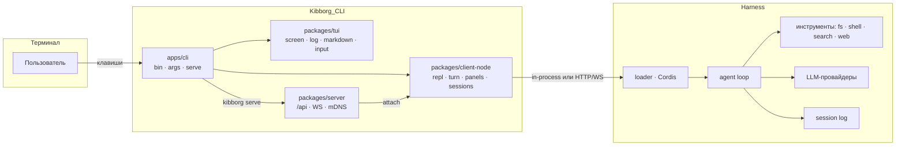

# Kibborg CLI

[English](README.md) | 中文

[](https://github.com/Ydjin1984/Kibborg_CLI/actions/workflows/ci.yml)
[](LICENSE)
[](https://nodejs.org)
[](https://pnpm.io)
[](packages/tui/tests)

**Kibborg CLI** — 面向你的代码工作的终端 agent：全屏 TUI、为 CI 准备的 headless 模式，以及面向服务器的网络模式。它与 Web 版 harness 使用同一个 agent、同一批工具和同一批会话，但完全运行在终端里。

```
  ◆ KIBBORG  v1.0.0   D:/work/project                          kibborg/Kibborg_Flash_v5.7   Agent
  ◇  ready   enter отправить   / команды   shift+tab режим            ▓▓▒▒░░░░░▒▒▓██████

  You
  почему сборка падает на Windows?

    ⚙  grep   "process.platform"                              +0 −0   120ms
      IN  { "pattern": "process.platform", "path": "scripts" }
      OUT scripts/build.ts:41: if (process.platform === 'win32') …

  ## Причина
  | Файл | Строка | Что не так |
  |---|---|---|
  | scripts/build.ts | 41 | путь собирается через «\\» вместо `path.join` |

  ```ts
  const out = join(root, 'dist', 'bundle.js')   // было: `${root}\\dist\\bundle.js`
  ```

  ⋯ 还有 12 行 — 按 Enter 展开

  ──────────────────────────────────────────────────────────────────────────────────────
  │ > █
  ──────────────────────────────────────────────────────────────────────────────────────
  ✻ kibborg/Kibborg_Flash_v5.7 · ctx 12% ▓▓░░░░░░░░ · 7.1s · 23.4k tok · master* · Agent

```

---

## Содержание

- [Возможности](#возможности)
- [Как это устроено](#как-это-устроено)
- [Установка](#установка)
- [Быстрый старт](#быстрый-старт)
- [Режимы работы](#режимы-работы)
- [Команды CLI](#команды-cli)
- [Команды внутри сессии](#команды-внутри-сессии)
- [Клавиши](#клавиши)
- [Лента: инструменты, diff, Markdown](#лента-инструменты-diff-markdown)
- [Выделение, копирование, ссылки](#выделение-копирование-ссылки)
- [Настройки](#настройки)
- [Переменные окружения](#переменные-окружения)
- [Сервер и контейнер](#сервер-и-контейнер)
- [Разработка](#разработка)
- [Диагностика](#диагностика)
- [Структура репозитория](#структура-репозитория)
- [Документация](#документация)
- [Лицензия](#лицензия)

---

## Возможности

| | |
|---|---|
| **Живой TUI** | Кадр собирается в буфер ячеек и печатается разницей. Верхняя строка отвечает «где я» (`≡ ветка  каталог … ctx 18%`), задача пользователя — строкой `> текст` со временем, поле ввода — рамка, в нижнюю границу которой вписаны модель и режим (`╰─ kibborg/… · Agent ───── 3 агента · 7 задач ─╯`), а строка подсказок клавиш между ними меняется по контексту. |
| **Палитра команд** | `/` открывает список команд; команды с решением открывают подменю (`/model`, `/effort`, `/permission`, `/resume`), строка `↩ назад` и `Esc` возвращают на уровень выше. |
| **Полный вывод инструментов** | Для каждого вызова: `IN` с аргументами как их прислала модель, `OUT` с полным ответом инструмента, diff со знаками `+`/`−` и сводкой `+N` зелёным и `−M` красным, время выполнения. Ничего не обрезается по ширине. |
| **Работа видна строкой** | Пока идёт ход, последняя строка ленты читается как `♦ Запускает go test ./...  24.0s  ↓34.7k  [stop]`: действие, время, токены и клавиша остановки; ответ заменяет её. |
| **Лента как переписка** | Задача пользователя — строка `> текст` со временем у правого края, ответ ассистента — с отступом и временем первой читаемой строки. Время ставится в момент появления сообщения и отключается настройкой `timestamps`. |
| **Кто работает** | Лента подписывает строки агентом: имя, модель и роль (`ORCHESTRATOR` / `EXECUTOR` / `SUBAGENT`), строки субагента — с отступом ветки. Цвет на агентов не тратится: он остаётся за состоянием — успех, предупреждение, ошибка, правка. |
| **Markdown** | Заголовки, списки, таблицы с выравниванием колонок, блоки кода с рельсом, инлайн-код, жирный, ссылки. |
| **Кликабельные ссылки** | URL и пути — настоящие гиперссылки терминала (OSC 8): `Ctrl`+клик открывает файл или страницу. |
| **Копирование** | Выделение, копирование и колесо мыши — терминальные: Kibborg не перехватывает мышь, как и Grok CLI, Codex, Claude Code и OpenCode, поэтому выделяется ровно то, что видно, и копируется штатным жестом терминала. |
| **Сворачивание** | Блок длиннее 5 строк показывается началом и строкой «⋯ ещё N строк — Enter, чтобы развернуть». |
| **Три режима** | Интерактив, headless (`-p`, `--output-format json|stream-json`) и сеть (`serve` + `attach` + `discover` по mDNS). |
| **Сессии и реестры** | Список, продолжение, поиск, переименование, fork, архив, экспорт; модели, MCP, навыки, инструменты, субагенты, задачи, статистика, настройки, ключи. |
| **Проверяемость** | 288 юнит-тестов, `oxlint` без замечаний, PTY-сценарии меню/команд/полноэкранного режима и инструмент кадров `tests/frame-render.mjs`. |

---

## Как это устроено

Kibborg CLI — самостоятельный продукт, но он использует ядро harness (`@deepseek-ai/dsh-*`). Поэтому для сборки ему нужна такая раскладка: монорепозиторий harness, внутри которого лежит каталог `Kibborg_CLI`.

```
<Kiborg>/
├── packages/                     ← harness 内核：会话、工具、LLM、MCP、skill …
├── vendor/                       ← vendored Cordis
├── node_modules/
└── Kibborg_CLI/                  ← 本仓库
    ├── apps/cli/                 ← `kibborg` 入口：参数解析、模式、serve
    ├── packages/tui/             ← 渲染：屏幕、帧、信息流、Markdown、命令面板、输入
    ├── packages/client-node/     ← CLI 逻辑：REPL、turn、面板、会话、剪贴板、链接
    ├── packages/server/          ← 网络模式：/api、WS、mDNS、token 网关
    ├── packages/cli-bundle/      ← harness loader 的 `kibborg` profile
    ├── tests/                    ← PTY 场景与帧工具
    └── scripts/                  ← bootstrap：一条命令完成布局与构建
```



关键点：**CLI 不复刻 Web 的逻辑**。本地模式在单进程内运行，不经过网络：传输层是构建在 `ctx.apiProxy` 之上的 `InProcessApiClient`。网络模式启动同一个进程，带 token 通过 HTTP 提供 `/api`，而 `attach` 客户端通过 WS 与它通信。

---

## 安装

### 方案 1：一条命令（推荐）

脚本会自行克隆 harness，把 `Kibborg_CLI` 放进其中，安装依赖，构建两部分，并创建 `kibborg` 命令。

```powershell
# Windows (PowerShell 7)
git clone https://github.com/Ydjin1984/Kibborg_CLI.git
pwsh -File Kibborg_CLI\scripts\bootstrap.ps1
```

```bash
# Linux / macOS
git clone https://github.com/Ydjin1984/Kibborg_CLI.git
sh Kibborg_CLI/scripts/bootstrap.sh
```

常用标志：`-Target <каталог>`（`--target`）、`-Ref <ветка>`（`--ref`）、`-SkipBuild`（`--skip-build`）、`-NoInstall`（`--no-install`）、`-Force`（`--force`）。

完成后重启终端并检查：

```bash
kibborg version      # 0.1.0
kibborg doctor       # проверка окружения
```

### 方案 2：在已有的 harness 克隆中手动安装

```bash
git clone https://github.com/Ydjin1984/DeepSeek_Kibborg_Harness.git
cd DeepSeek_Kibborg_Harness
git clone https://github.com/Ydjin1984/Kibborg_CLI.git

pnpm install
pnpm run build                       # ядро harness
pnpm --dir Kibborg_CLI run build     # сам CLI

pwsh -File Kibborg_CLI/install.ps1   # Windows: шим + PATH
sh Kibborg_CLI/install.sh            # Linux / macOS: ~/.local/bin + ~/.profile
```

安装脚本不需要管理员权限，不写入系统目录，也不从网络下载任何内容。验证安装并将其移除：

```powershell
powershell -NoProfile -File Kibborg_CLI\install.ps1 -DryRun     # только показать план
powershell -NoProfile -File Kibborg_CLI\uninstall.ps1           # удалить шимы
```

```bash
sh Kibborg_CLI/install.sh --dry-run
sh Kibborg_CLI/uninstall.sh
```

### 方案 3：只构建，不安装命令

```bash
node Kibborg_CLI/apps/cli/lib/bin.js version
node Kibborg_CLI/apps/cli/lib/bin.js "объясни структуру проекта"
```

### 环境要求

| 组件 | 版本 | 用途 |
|---|---|---|
| Node.js | `^22.19.0 \|\| >=24.0.0` | 构建与运行 |
| pnpm | 11.x | harness 工作区 |
| Git | 任意版本 | 克隆 |
| 模型密钥 | `DEEPSEEK_API_KEY` 或 `$DSH_HOME/.credentials.yaml` | agent 的真实轮次 |

终端：**Windows Terminal**、PowerShell 7、WSL、macOS Terminal、iTerm2、GNOME Terminal、VS Code Terminal。若要使用 `Shift+Enter`、超链接以及正确的剪贴板编码，推荐 Windows Terminal（或任何支持 OSC 8 与 UTF-8 西里尔字符的终端）。

---

## 快速开始

```bash
kibborg                                  # интерактивная сессия в текущем каталоге
kibborg "проанализируй этот проект"      # одна задача и выход
kibborg --continue                       # продолжить последнюю сессию каталога
kibborg --fullscreen                     # полноэкранный режим
```

```bash
# headless: stdout — только результат, лента — в stderr
kibborg -p "describe the repo" --output-format json
kibborg -p --prompt-file task.md --json-schema schema.json --max-turns 3
git diff | kibborg -p "отревьюй изменения"
```

```bash
# сервер: один процесс, много подключений
kibborg serve --port 7317 --token "$(openssl rand -hex 16)"
kibborg discover                                   # найти серверы в локальной сети
kibborg attach http://127.0.0.1:7317 --token <токен>
```

---

## 运行模式

### 交互模式

信息流与输入行共处同一帧。模式由 `screen` 设置或命令行标志决定：

```bash
kibborg                  # полноэкранный кадр по умолчанию (screen = fullscreen)
kibborg --fullscreen     # то же явно: альтернативный экран, кадр владеет терминалом
kibborg --minimal        # inline без захвата экрана
```

如果终端不是交互式的、不支持备用屏幕、设置了 `KIBBORG_INLINE=1`，或选择了 `screen = inline|minimal`，CLI 会停留在 inline（回滚缓冲）模式。

### Headless

| 标志 | 含义 |
|---|---|
| `-p`, `--print` | 不进入交互模式，打印结果后退出 |
| `--output-format text\|json\|stream-json` | stdout 的格式（`text` — 仅回答，`json` — 含 `result`、`sessionId`、`usage` 的对象，`stream-json` — 逐行事件） |
| `--include-partial-messages` | 在 `stream-json` 中加入部分消息 |
| `--json-schema <файл\|json>` | 按 schema 校验回答；不匹配 → stderr + 退出码 1 |
| `--max-turns N` | 限制轮次数量；达到上限时输出 `kind: "max-turns"` 并返回退出码 1 |
| `--no-session-persistence` | 不保存会话（该轮次结束后会话进入归档） |
| `--prompt-file <файл>` | 从文件读取任务 |
| `--question-answers <файл>` | 预先准备好的、对 agent 提问的回答 |

退出码：`0` 成功，`1` 错误或 schema 不匹配／达到轮次上限，`2` 配置与环境错误，`3` 需要交互式回答，`130` 被用户中断。

### 网络模式

```bash
kibborg serve --port 7317 --token <секрет> --mdns --instance kibborg-work
kibborg attach <url> --token <секрет> -p "задача"        # разовый запрос
kibborg attach <url> --token <секрет>                     # полноценный TUI поверх сети
```

`serve` 在非 loopback 接口上缺少 token 时拒绝启动（退出码 2）并打印原因。`/api` 在没有 token 时返回 `401`，带 token 时按普通 RPC 调用处理；`GET /healthz` 返回 `{"ok":true,...}`，供负载均衡器和 systemd 使用。

---

## CLI 命令

| 命令 | 作用 |
|---|---|
| `kibborg [задача]` | 一次性任务；未传入任务时进入交互式会话 |
| `kibborg run [задача]` | 同样的行为，但用显式命令（适合脚本） |
| `kibborg version` | CLI 版本 |
| `kibborg doctor [--fix] [--json]` | 环境检查：Node、pnpm、profile、密钥、存储、mDNS |
| `kibborg serve` | 启动网络服务器（`--port`、`--token`、`--mdns`、`--instance`） |
| `kibborg attach <url>` | 连接服务器（`--token`，其余参数与普通启动相同） |
| `kibborg discover [--timeout N]` | 通过 mDNS 查找局域网中的服务器 |
| `kibborg sessions [--json]` | 会话列表 |
| `kibborg resume [id]` | 恢复会话（不带 id 时从列表中选择） |
| `kibborg search <текст>` | 在会话历史中搜索 |
| `kibborg rename <id> <название>` | 重命名会话 |
| `kibborg fork [id]` | 派生（fork）会话 |
| `kibborg archive <id>` | 将会话移入归档 |
| `kibborg export <id> [-o файл]` | 将会话导出为 zip（transcript、事件、元数据） |
| `kibborg agents` | subagent：谁在运行、处于什么状态 |
| `kibborg jobs [--json]` | 进程的后台任务 |
| `kibborg commands [--json]` | 会话认识的命令（本地命令与宿主命令） |
| `kibborg tools [--json]` | 模型可用的工具 |
| `kibborg models` | 模型与提供方目录 |
| `kibborg mcp` | MCP 服务器及其状态 |
| `kibborg skills` | 项目中的 skill |
| `kibborg stats [--json]` | 会话与 token 统计 |
| `kibborg settings [show\|set\|unset]` | harness 设置与 `kibborg-cli` 分区 |
| `kibborg auth` | 密钥状态及其存储方式 |
| `kibborg --dump-config` | `kibborg` profile 的生效配置 |
| `kibborg --help` | 所有命令与标志的帮助 |

任务通用标志：`--model`、`--effort low|medium|high`、`--permission-mode`、`--safe`、`--auto`、`--yolo`、`--continue`、`--fullscreen`、`--minimal`。

---

## 会话内命令

斜杠命令在输入行中输入。还需要再做一次选择的命令会打开选择列表。

| 命令 | 动作 |
|---|---|
| `/new` | 在当前目录创建新会话并切换到它 |
| `/resume`, `/sessions` | 最近会话列表；`Enter` 直接切换 |
| `/model` | 模型目录，并标出当前模型 |
| `/effort` | `low`、`medium`、`high` |
| `/permission` | 宿主预设列表：`read-only`、`workspace-write`、`danger-full-access` |
| `/quit` | 退出会话 |
| `/help` | 界面命令与宿主命令的列表 |
| `/status` | 会话、目录、模型、推理强度、模式、上下文、分支 |
| `/panel` | 带标签页的模态窗口：skill、MCP、钩子、插件、权限 |
| `/panels [имя]` | 实时数据：`sessions`、`subagents`、`jobs`、`queue`、`context`、`goals`、`todos` |
| `/find <текст>` | 在当前对话中搜索 |
| `/copy` | 把最后一个回答复制到剪贴板 |
| `/like [note]` | 把最后一个回答标记为有用（Like） |
| `/dislike [note]` | 把最后一个回答标记为无用（Dislike） |
| `/transcript [файл]` | 把对话导出为 Markdown |
| `/mcp`, `/skills` | MCP 与 skill 的注册表 |
| `/compact`, `/plan`, `/goal`, `/feedback` | 宿主命令：上下文压缩、计划、目标、反馈 |

拼写错误不会发给模型：`/statuss` 会被识别为拼写错误并建议 `/status`，而 skill 名称（`/caveman …`）会作为提示词发送给 agent。

---

## 按键

| 按键 | 动作 |
|---|---|
| `Enter` | 发送输入行、应用选中项，或展开选中的信息流条目 |
| `Shift+Enter`, `Ctrl+J` | 在输入行中换行；输入窗口最多长到 8 行，之后在自身内部滚动 |
| `Esc` | 关闭列表或提问、清空输入（永不退出，也不中断轮次） |
| `Ctrl+C` | 中断轮次；不在轮次中时清空草稿并退出 |
| `Ctrl+D` | 退出 |
| `Ctrl+O` | 在 `--fullscreen` 模式下打开实时数据面板；在 inline 模式下用 `/panel` 命令打开面板 |
| `Tab` / `Shift+Tab` | 在信息流与输入之间切换焦点；有草稿时补全输入。不在提问中时，`Shift+Tab` 切换权限模式 |
| `↑` / `↓` | 选择信息流条目（输入为空时）、浏览输入历史，或在提问窗口中选择选项 |
| `h` / `l` | 折叠／展开选中的信息流条目 |
| `y` | 完整复制选中的条目——包括工具参数与工具输出 |
| `Space` | 在多选提问中标记选项 |
| `PgUp` / `PgDn` | 按屏滚动 |
| `Home` / `End` | 跳到信息流的开头／结尾 |
| `Ctrl+X` | 按键帮助：打印到信息流中，便于阅读与复制 |
| `Ctrl+U` | 清空输入行 |
| 鼠标拖选 | 终端自带的选中，并用同一手势完成复制 |
| `Ctrl`+单击 | 打开光标下的链接、文件或路径 |

只有在开启鼠标捕获（`KIBBORG_MOUSE=1`）时，滚轮才滚动信息流：默认情况下，与 Grok CLI、Codex、Claude Code 和 OpenCode 一样，Kibborg 不接管鼠标，因此选中与复制始终由终端负责。

`Shift+Enter` 依赖 Win32 input mode（`ESC[?9001h`）和 kitty keyboard protocol（`ESC[>1u`）；在不支持它们的终端中请使用 `Ctrl+J`。关闭这些模式：`KIBBORG_NO_WIN32_INPUT=1`。

补全候选（项目文件与会话）在第一次按 `Tab` 时收集，而不是在启动时：扫描深层目录和会话列表要花上几秒，而界面无需等待它即可打开。第一次按下会显示「正在收集提示…」并立即给出列表。

## 提问与确认

当模型需要用户决策时，它会调用 `ask_user_question`，屏幕上随即出现提问框：

```
╭ Question  1/1 ─────────────────────────────────────────────────────╮
│ Продолжить работу или остановиться?                                 │
│ ▸ Продолжить                                                        │
│   Остановиться                                                      │
│                                                                     │
│ other… > _                                                          │
│ [↑↓] выбрать   [enter] подтвердить   [esc] отменить                 │
╰─────────────────────────────────────────────────────────────────────╯
```

- `↑`/`↓` 移动高亮，`Enter` 确认选择，`Esc` 取消提问；
- 多选时 `Space` 标记选项，`Enter` 发送已标记的选项；
- 自己的回答也可以直接在输入行中输入：填选项编号，多个选项写 `1,3`，或写 `other:свой текст`；
- 工具确认请求（`y` — 仅本次，`a` — 本会话，`n` — 拒绝）也在同一位置显示。

---

## 信息流：呈现正在发生的事，而不是协议

信息流只回答一个问题——agent 此刻在做什么。工具行用文字描述动作，而参数、输出和 diff 位于第二层，用 Enter 键展开：

```
  ◆ KIBORG   deepseek-official/deepseek-v4-flash   ORCHESTRATOR
    →  Делегирует: посчитать строки SECURITY.md   ▸ аргументы
  ┌─ ◐  Подсчёт строк SECURITY.md   kibborg/Kibborg_Flash_v5.7   EXECUTOR ────────── ◐ WORKING ┐
  │  ⋯ 7 шагов этой ветки — Enter, чтобы развернуть                                             │
  └─ ✔️  Подсчёт строк SECURITY.md ──────────────────────────────────────────── ✔ DONE ┘
  ◆ KIBORG   deepseek-official/deepseek-v4-flash   ORCHESTRATOR
    ▣  Читает D:\Deepseec_DaVinchi\Kibborg_CLI\SECURITY.md   ▸ аргументы
```

- 动作字形：`◐` 正在工作，`✔️` 成功，`✕` 失败，`▣` 文件，`→` 委派，`◌` 思考；
- `▸ аргументы · вывод` 是标记行：在选中的条目上按 `Enter` 会展开该条目的 `IN`、`OUT` 和 diff，再次按下即折叠；
- 过长的参数按字形与尾部占位之后剩下的列宽截断：路径保留开头和文件名（`Читает C:/Users/lex66/…/dist/index.js`），命令保留开头，而 `+N`、`−M` 计数与耗时始终可见；
- 已结束的 subagent 分支折叠成一行 `⋯ N шагов этой ветки`，在其行上按 `Enter` 可再次展开；
- agent 的颜色回答「是谁」，角色是低饱和的徽标，动作有自己的语义；这是三条独立的轴，而不是一套配色包打天下。

模型的回答始终是展开的，并按文档渲染：标题带标记，一级标题下带线，每个块前留空行，表格在表头下和表体下都画线，代码放在 `┌─ lang … └─` 框中，不同层级用不同的列表标记，而链接和路径可点击（Ctrl+单击）。之前的回答会折叠，以保持信息流可读。

---

### 标记行背后的细节

`▸ аргументы · вывод` 这一行会展开整条记录：

```
    ▣  Правит src/build.ts   +2 −1   135ms
      IN  {
            "file_path": "src/build.ts",
            "old_string": "const out = `${root}\\\\dist`",
            "new_string": "const out = join(root, 'dist')"
          }
      @@ src/build.ts
       const root = cwd()
      -const out = `${root}\\dist`
      +const out = join(root, 'dist')
       export { out }
      OUT The file src/build.ts has been updated successfully.
```

- `IN` 是模型原样发来的参数（带缩进的 JSON）；
- `OUT` 是模型看到的完整工具结果；
- diff 中 `+` 行为绿色、`−` 行为红色，并带 `@@ путь` 标题；新建文件时所有行都是新增；
- `+N −M` 与耗时显示在标题中；
- 过长的行会**换行**，而不是被截断。

---

## 谁在工作：agent、模型与角色

一轮并不总是由一个模型完成。在 orchestrator 模式下，对话由「头」主导（它负责规划与委派），繁重的工作交给本地 executor —— 一个拥有自己会话的独立 subagent。每次委派都绘制成一个方框，因此能看出哪个模型做了什么、这一分支以什么结果结束：

```
  ◆  KIBORG   deepseek-official/deepseek-v4-flash   ORCHESTRATOR
    →  Делегирует: посчитать строки SECURITY.md   ▸ аргументы
  ┌─ ◐  Подсчёт строк SECURITY.md   kibborg/Kibborg_Flash_v5.7   EXECUTOR ────── ◐ WORKING ┐
  │  ⋯ 7 шагов этой ветки — Enter, чтобы развернуть                                         │
  └─ ✔️  Подсчёт строк SECURITY.md ──────────────────────────────── ✔ DONE ┘
  ◆  KIBORG   deepseek-official/deepseek-v4-flash   ORCHESTRATOR
    ▣  Читает D:\Deepseec_DaVinchi\Kibborg_CLI\SECURITY.md   ▸ аргументы
```

- `◆` 是你正在其中输入的会话；`┌─ ◐` 与 `└─ ✔️` 是 subagent 分支的边框：agent 开始时打开，结束时闭合；
- subagent 的名字就是委派标签（在 orchestrator 模式下，是交给它的任务描述）；
- 角色：头为 `ORCHESTRATOR`（启用 orchestrator 时），挂在 `executorProvider/executorModel` 路由上的 subagent 为 `EXECUTOR`，其余为 `SUBAGENT`；角色未知时不打印；
- agent 的颜色回答「是谁」，角色用低饱和的徽标显示，而动作有自己的语义；同一次运行中的不同模型一眼可辨；
- subagent 的行位于方框侧壁之间，它自己的文本不会进入信息流——只看得到动作：它在忙什么，而不是它的对话内容；
- 进行中的分支保持展开，已结束的分支折叠为 `⋯ N шагов этой ветки` 一行；在分支行上按 `Enter` 可展开或折叠它。

所有数据都来自宿主的事实：会话列表（`parentSessionId`、`origin`、`agentPreset`）、子会话日志中的 `request/header` 与 `subagent/descriptor` 事件，以及 `subagent` / `subagentActivity` 投影。关闭 orchestrator（`kibborg settings set orchestrator '{"enabled":false}'`）后，头只是没有角色，信息流继续正常工作。

完全关闭 agent 标注：`KIBBORG_NO_AGENTS=1`（信息流保持原样，如同只有单一模型）。

---

## 选中、复制与链接

当界面接管鼠标时（滚轮与滚动需要它），终端自己无法选中文本，因此选中由界面完成：

1. 用鼠标划过需要的行——该区域会高亮；
2. 松开按键——文本立即进入剪贴板，信息流中会出现「скопировано строк: N」（该消息五秒后消失）。

编码得以保留：在 Windows 上文本经由带临时 UTF-8 文件的 `Set-Clipboard` 传递，因为 `clip.exe` 会按控制台代码页读取 stdin。链接和路径标记为 OSC 8 超链接——`Ctrl`+单击可在关联应用中打开文件，或在浏览器中打开 URL。

默认情况下，Kibborg 不请求 mouse-reporting：选中与复制由终端完成。用 `KIBBORG_MOUSE=1` 开启捕获后，滚轮与对标记行的单击才会生效。

---

## 设置

`kibborg-cli` 分区保存在 `$DSH_HOME/settings.yaml` 中，并在构建帧之前读取：

| 配置键 | 取值 | 默认值 | 作用 |
|---|---|---|---|
| `theme` | `ice`, `terminal`, `mono` | `ice` | 配色：GrokNight、终端 profile 的颜色，或单色 |
| `timestamps` | `true`, `false` | `true` | 对话消息旁的时间 |
| `multiline` | `true`, `false` | `false` | `Enter` 换行，`Ctrl+J` 发送 |
| `screen` | `inline`, `fullscreen`, `minimal` | `fullscreen` | 屏幕模式 |

```bash
kibborg settings show kibborg-cli
kibborg settings set kibborg-cli theme terminal
kibborg settings set kibborg-cli timestamps true
kibborg settings unset kibborg-cli theme
kibborg settings show orchestrator          # настройки оркестратора (head/executor модели)
```

---

## 环境变量

| 变量 | 用途 |
|---|---|
| `DEEPSEEK_API_KEY` | 模型密钥；也可改用 `$DSH_HOME/.credentials.yaml` |
| `DSH_HOME` | harness 的状态目录（默认 `~/.dsh`）：会话、设置、密钥 |
| `KIBBORG_MODEL` | 启动时使用的默认模型 |
| `KIBBORG_EFFORT` | 推理强度：`low`、`medium`、`high` |
| `KIBBORG_INTENT` | 在 CLI 进程之间内部传递已解析的意图 |
| `KIBBORG_SERVER_TOKEN` | 网络服务器的 token（等同于 `--token`） |
| `KIBBORG_SERVE_PORT` | 未指定 `--port` 时服务器的端口 |
| `KIBBORG_SERVE_MDNS` | 在局域网中发布该服务器 |
| `KIBBORG_SERVE_INSTANCE` | 供 `discover` 使用的服务器名称 |
| `KIBBORG_INLINE=1` | 始终使用 inline：不接管屏幕 |
| `KIBBORG_MOUSE=1` | 捕获鼠标：滚轮与对标记行的单击 |
| `KIBBORG_NO_WIN32_INPUT=1` | 不启用 Win32 input mode 与 kitty protocol |
| `KIBBORG_LOG` | 日志级别：`info`（默认）、`trace`、`error`、`off` |
| `KIBBORG_LOG_FILE` | 日志路径；默认 `$DSH_HOME/logs/kibborg.jsonl` |
| `KIBBORG_TRACE=1` | 把决策与按键的追踪写入 stderr |
| `DSH_PERMISSION_MODE` | 启动时的权限模式（可被 `/permission` 覆盖） |
| `DSH_TOOLS_MODE` | 代码执行模式：`native`（默认）或 `code`/`both` —— 后者启用 Code Mode（`run_code` 工具） |
| `NO_COLOR`, `TERM=dumb`, `CI` | 关闭颜色与交互（CLI 的通行做法） |

---

## 服务器与容器

### systemd

```ini
# /etc/systemd/system/kibborg.service
[Unit]
Description=Kibborg CLI server
After=network.target

[Service]
User=kibborg
Environment=KIBBORG_SERVER_TOKEN=<секрет>
Environment=DEEPSEEK_API_KEY=<ключ>
ExecStart=/usr/bin/node /opt/kibborg/Kibborg_CLI/apps/cli/lib/bin.js serve --port 7317
Restart=on-failure

[Install]
WantedBy=multi-user.target
```

现成的文件位于 `deploy/`：`kibborg.service`、`kibborg.env.example`、`healthcheck.sh`。

### Docker

```bash
docker build -t kibborg-cli -f deploy/Dockerfile .
docker run --rm -it -p 7317:7317 \
  -e KIBBORG_SERVER_TOKEN=<секрет> \
  -e DEEPSEEK_API_KEY=<ключ> \
  -v "$PWD:/work" kibborg-cli
```

`deploy/docker-compose.yml` 会启动带 healthcheck 的服务器；检查方式为 `curl -fsS http://127.0.0.1:7317/healthz`。

### 连接服务器的客户端

```bash
kibborg discover                                  # найти серверы в сети (mDNS)
kibborg attach http://10.0.0.5:7317 --token <секрет>
```

无 token 的网络模式只允许在 loopback 上使用；对外部地址则必须提供 token。

---

## 开发

```bash
cd Kibborg_CLI
pnpm run build      # tsc -b + tsdown → apps/cli/lib
pnpm run test       # vitest, 235 тестов
pnpm run lint       # oxlint, 0 замечаний
```

终端检查：

```bash
node tests/pty-menu.mjs --boot-ms 55000              # палитра, подменю, возврат
node tests/pty-commands.mjs                          # локальные команды, автодополнение, модал
node tests/pty-fullscreen.mjs --boot-ms 45000        # полноэкранный кадр, скролл, ресайз
node tests/pty-approval.mjs                          # запросы подтверждений
node tests/load-check.mjs --runs 3                   # метрики старта
```

把终端帧转成文本与 HTML —— 用来替代截图：

```bash
node tests/frame-render.mjs --boot-ms 45000 --cols 120 --rows 40 \
  --send "/status" --keys "\u001b[B"
# → tests/frame.txt, tests/frame.html, tests/frame.raw.txt
```

当某个按键作用于命令刚刚打开的列表时，场景要用步骤来定义——步骤按给定顺序执行，而不是「先执行所有命令，再发送所有按键」：

```bash
node tests/frame-render.mjs --boot-ms 20000 --step "send:/model" \
  --step "keys:\u001b[B" --step "keys:\r" --step "keys:\u001b[A" --step "keys:\r"
```

长信息流下的帧开销单独测量——滚动是连续的按键流，每个按键都要绘制一帧：

```bash
node tests/perf-scroll.mjs --entries 20000
```

会话中发生了什么，可以从它的日志看出——日志位于 `$DSH_HOME/sessions/<каталог>/<id>/session.jsonl.zstd`，以 zstd 帧存储：

```bash
node tests/session-log-summary.mjs "$DSH_HOME/sessions/--D-Deepseec_DaVinchi--/<id>/session.jsonl.zstd"
```

环境限制：Windows 上的 `conpty` 不透传备用屏幕、mouse 事件和 win32-input-mode。这类行为由单元测试验证，而不是 PTY。

---

## 诊断

### 操作日志

Kibborg 会记录用户做了什么、结果如何：每个按键以及处理它的组件，每个动作（选择条目、展开、复制、滚动）及其耗时、结果与拒绝原因，以及每条命令、每个轮次和每个错误。格式为 JSONL，一行一条记录：

```json
{"time":"2026-09-13T17:39:10.891Z","level":"trace","scope":"view","action":"scroll-down","ok":false,"reason":"лента уже на краю","details":{"from":0,"to":0,"total":7,"viewport":16,"follow":true}}
```

| 项目 | 位置 |
|---|---|
| 级别 | `KIBBORG_LOG=info`（默认：动作、命令、轮次、错误）、`trace`（外加每个按键与每一帧及其耗时和数据量）、`error`（仅故障）、`off` |
| 文件 | `$DSH_HOME/logs/kibborg.jsonl`，可用 `KIBBORG_LOG_FILE` 覆盖；文件按 5 MB 轮转，保留 5 份 |
| 就地读取 | `/logs` 打印最近的记录；输出中不显示帧，只做计数 |
| 动作为何没生效 | 记录中的 `reason` 字段；帧与按键带有 `details.by` —— 处理该按键的组件：`menu`、`dialog`、`reader`、`surface` 或 `loop` |
| 终端上报的噪声 | `scope: input`、`action: noise` 记录：终端在没有前导 `ESC` 的情况下发来的 `[13;28;13;1;0;1_` 之类的尾部数据会被丢弃，而不会进入输入框 |

例如排查「在行上按 Enter 没有展开块」：日志中会出现记录 `scope: reader`、`action: toggle-entry`、`ok: false`、`reason: "у записи нет скрытых строк: разворачивать нечего"` 和 `details: {entryId, kind, expanded, lines, delta}`。

此外，宿主及其插件的 `stderr` 也会以 `scope: stderr` 的 `error` 级记录写入日志——正是那里能看到过去只在帧中一闪而过的堆栈跟踪。

| 症状 | 处理方式 |
|---|---|
| `kibborg: a task is required` | 传入任务：`kibborg "…"` 或 `kibborg -p "…"` |
| `нужен ключ модели` | 设置 `DEEPSEEK_API_KEY`，或把密钥保存到 `$DSH_HOME/.credentials.yaml`（`kibborg auth`） |
| 终端闪烁、帧无法组装 | `kibborg --minimal` 或 `KIBBORG_INLINE=1` |
| 帧中字符错乱 | 终端不支持 UTF-8：启用 UTF-8 或设 `KIBBORG_INLINE=1` |
| `Shift+Enter` 不生效 | 改用 `Ctrl+J`；检查 `KIBBORG_NO_WIN32_INPUT` |
| 输入框里出现 `[13;28;13;1;0;1_` 之类的垃圾 | 更新 CLI：这类尾部数据会被丢弃并作为 `scope: input` 写入日志；要完全绕过可设 `KIBBORG_NO_WIN32_INPUT=1` |
| 复制出来是乱码 | 更新 CLI：复制经由 `Set-Clipboard` 完成；用 `Get-Clipboard -Raw` 检查 |
| 某个操作对按键没有反应 | 用 `/logs` 查看最近记录的 `ok` 与 `reason`；要看完整事件流则设 `KIBBORG_LOG=trace` |
| `serve` 拒绝启动 | 非 loopback 且没有 token：加上 `--token`，或监听 `127.0.0.1` |
| `attach` 返回 401 | token 与服务器的 `KIBBORG_SERVER_TOKEN` 不一致 |
| 需要更多细节 | `/logs`、`KIBBORG_LOG=trace kibborg …`，然后 `kibborg doctor --json` |

更多情况见 [TROUBLESHOOTING.md](TROUBLESHOOTING.md)。

---

## 仓库结构

```
Kibborg_CLI/
├── apps/cli/                 точка входа: bin, args, serve, profile-boot
├── packages/
│   ├── tui/                  рендер и ввод: screen, framebuffer, layout, log, markdown, menus, panels
│   ├── client-node/          REPL, turn, панели, сессии, транскрипт, буфер обмена, открытие ссылок
│   ├── server/               сетевой режим: /api, WS-даунлинки, mDNS, гейт токена
│   └── cli-bundle/           профиль `kibborg` и секция настроек
├── tests/                    PTY-сценарии, инструмент кадров, метрики старта
├── scripts/                  bootstrap.ps1 / bootstrap.sh
├── deploy/                   systemd, Dockerfile, compose, healthcheck
├── examples/                 GitHub Actions, cron
├── install.ps1 / install.sh  установка команды `kibborg`
├── uninstall.ps1 / uninstall.sh
└── bin/                      шим для локального запуска из исходников
```

---

## 文档

| 文件 | 内容 |
|---|---|
| [ARCHITECTURE.md](ARCHITECTURE.md) | 分层、数据流、决策、中断约定 |
| [TUI.md](TUI.md) | 界面设计规范：屏幕、信息流、命令面板、设计令牌 |
| [TASKS.md](TASKS.md) | K0…K8 阶段登记表与修复历史 |
| [UI_GROK_PLAN.md](UI_GROK_PLAN.md) | 参照 Grok CLI 重做界面的计划：四个 CLI 的事实、阶段 0–5、产物与检查 |
| [CHECKLIST.md](CHECKLIST.md) | 各阶段验收与功能矩阵 |
| [TROUBLESHOOTING.md](TROUBLESHOOTING.md) | 症状 → 原因 → 处理 |
| [PLAN.md](PLAN.md) | 产品最初的规格说明 |
| [CONTRIBUTING.md](CONTRIBUTING.md) | 如何构建、检查并提交改动 |
| [CHANGELOG.md](CHANGELOG.md) | 各版本包含的内容 |
| [SECURITY.md](SECURITY.md) | 如何报告漏洞，以及什么算漏洞 |

---

## 许可证

[MIT](LICENSE)。项目使用 harness 内核（[DeepSeek_Kibborg_Harness](https://github.com/Ydjin1984/DeepSeek_Kibborg_Harness)），它有自己的许可证——见其仓库。
